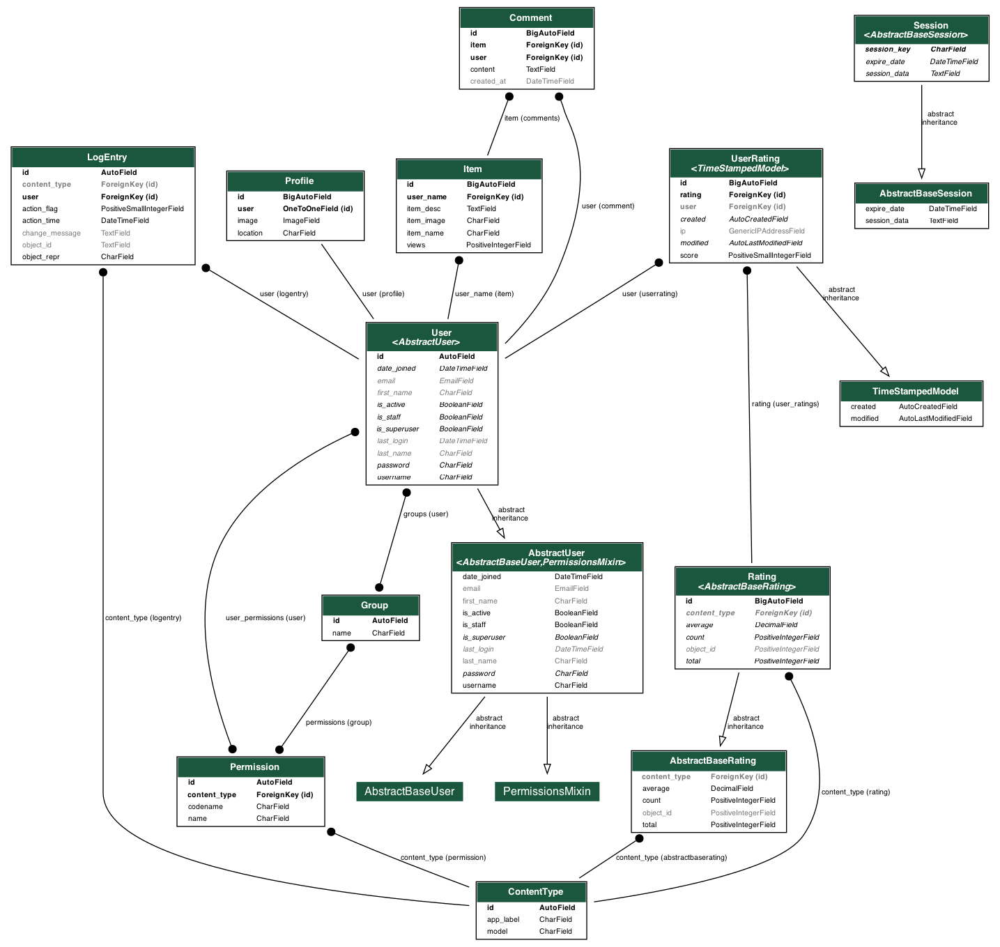

# Django Food Recipes Project

## Overview

This project is a web application for managing and sharing food recipes. It is built using Django for the backend and includes features for user authentication, recipe management, commenting, and rating. The project also includes a mobile app built with React Native.

## Features

- User registration and authentication
- Recipe creation, update, and deletion
- Commenting and rating on recipes
- Profile management
- Mobile app support with React Native

## Project Structure

.
├── .venv # Python virtual environment
├── api # Django app for API endpoints
│ ├── migrations
│ ├── init.py
│ ├── admin.py
│ ├── apps.py
│ ├── models.py
│ ├── serializers.py
│ ├── tests.py
│ ├── urls.py
│ └── views.py
├── food # Django app for managing food recipes
│ ├── migrations
│ ├── static
│ ├── templates
│ │ ├── django_filters
│ │ └── food
│ ├── init.py
│ ├── admin.py
│ ├── apps.py
│ ├── errors.py
│ ├── forms.py
│ ├── models.py
│ ├── tests.py
│ ├── urls.py
│ └── views.py
├── mysite # Project settings and configurations
│ ├── init.py
│ ├── asgi.py
│ ├── settings.py
│ ├── urls.py
│ └── wsgi.py
├── pictures # Static images
│ └── profile_pictures
│ └── profilepic.jpg
├── users # Django app for user management
│ ├── migrations
│ ├── templates
│ │ └── users
│ ├── init.py
│ ├── admin.py
│ ├── apps.py
│ ├── forms.py
│ ├── models.py
│ ├── signals.py
│ ├── tests.py
│ └── views.py
├── .dockerignore # Files to ignore in Docker builds
├── .gitignore # Files to ignore in Git
├── db.sqlite3 # SQLite database
├── docker-compose.yml # Docker Compose configuration
├── docker_compose.yaml # Alternative Docker Compose configuration
├── Dockerfile # Docker configuration
├── manage.py # Django management script
├── myapp_models.png # Database diagram
├── package-lock.json # NPM package lock file
├── requirements.txt # Python dependencies

markdown


## Setup and Installation

### Prerequisites

- Python 3.12
- Node.js
- Docker
- PostgreSQL (for production)

### Backend Setup

1. **Clone the repository:**
   ```bash
   git clone https://github.com/divanster/djangofoodrecepies.git
   cd djangofoodrecepies

    Create a virtual environment and activate it:

    bash

python -m venv .venv
source .venv/bin/activate

Install the dependencies:

bash

pip install -r requirements.txt

Apply migrations:

bash

python manage.py migrate

Run the development server:

bash

    python manage.py runserver

Mobile App Setup

    Navigate to the mobile app directory:

    bash

cd mobileapp

Install the dependencies:

bash

npm install

Start the Metro bundler:

bash

npx react-native start

Run the mobile app on an emulator or device:

bash

    npx react-native run-android   # For Android
    npx react-native run-ios       # For iOS

Usage

    Access the web application at http://localhost:8000.
    Access the API endpoints at http://localhost:8000/api/.
    Use the mobile app to interact with the backend.

License

This project is licensed under the MIT License.


Database Diagram


